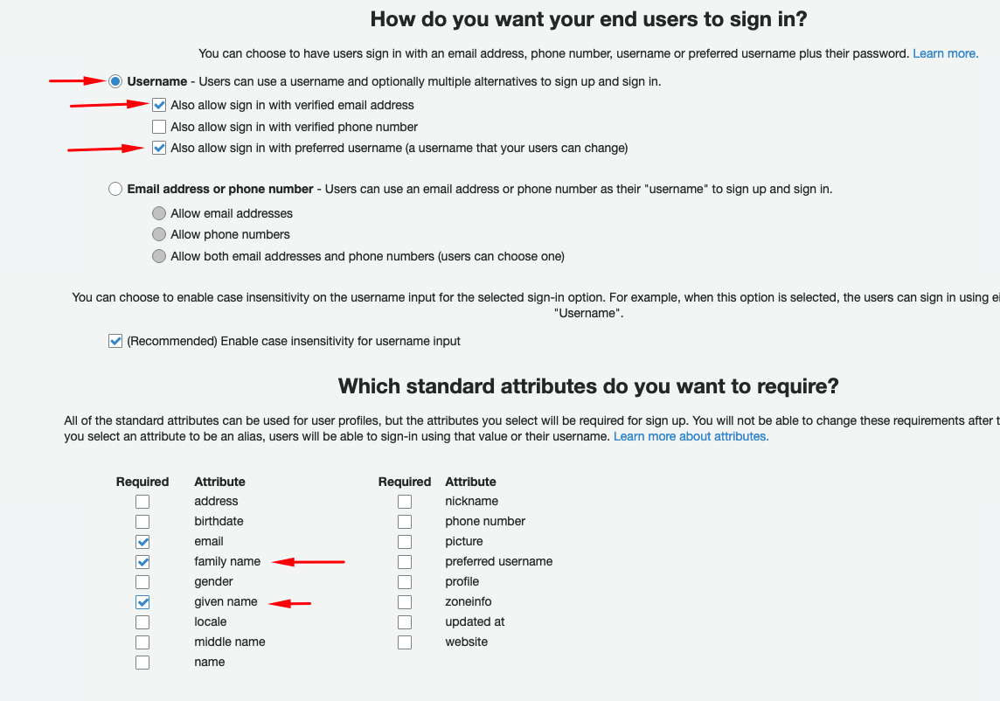
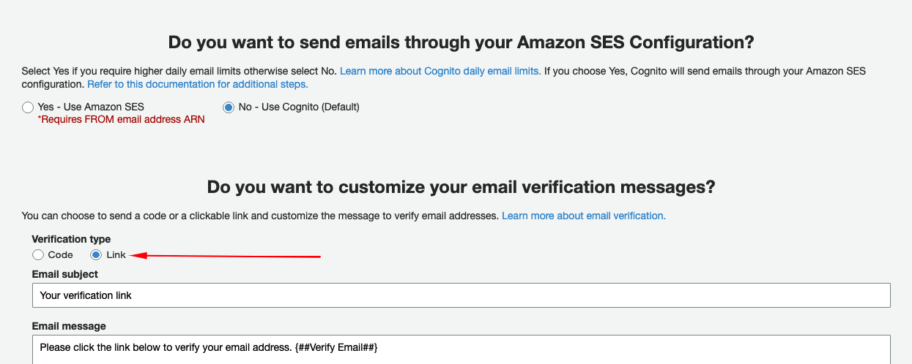
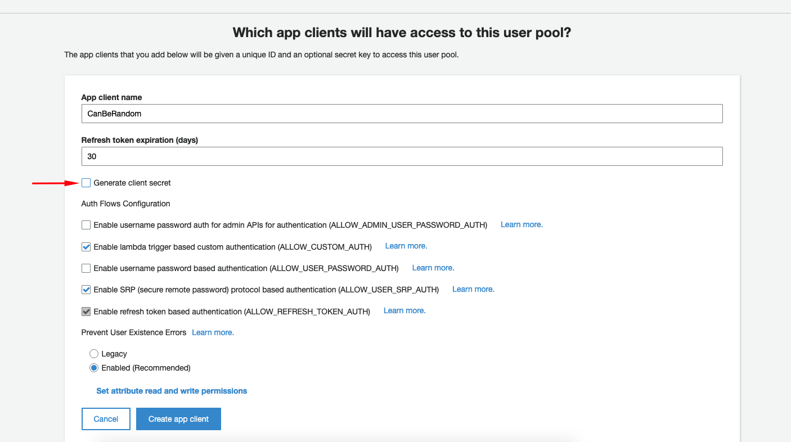
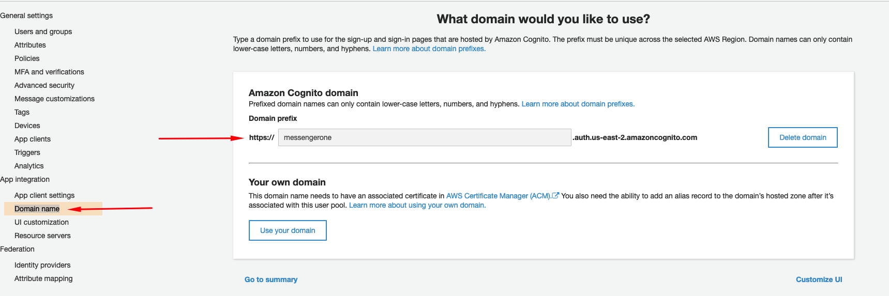
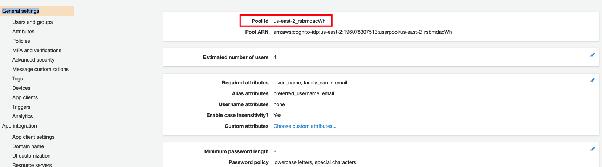
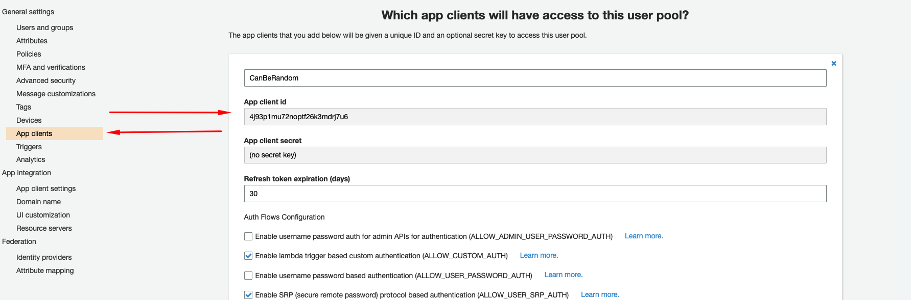

# poocho
> This document is an outline for poocho | milestone one


# Dependencies

> Please list any/all dependencies that we will be using here

| Name       | Function                | URL                         |
| ---------- | ----------------------- | --------------------------- |
| React.JS   | Frontend                | https://reactjs.org/        |
| Redux      | Middleware              | https://redux-saga.js.org/  |
| Postgres   | Database                | https://www.postgresql.org/ |
| Go         | Messaging Infrastucture | https://golang.org/         |
| NATS       | Pub/Sub Messaging       | https://nats.io/            |
| Amazon SES | Emails                  | https://aws.amazon.com/ses  |
| Amazon SNS | Notifications/SMS       | https://aws.amazon.com/sns  |


### 🌐 Domain Settings & Verified Services

| Domain          | Purpose       | DNS        |  AWS  | GSuite      |  SES  | DKIM  | Google MX |
| :-------------- | ------------- | :--------- | :---: | :---------- | :---: | :---: | :-------: |
| `poocho.co`     | Main Homepage | Cloudflare |   ✓   | ✓ *primary* |   ✓   |   ✓   |     ✓     |
| `justpoocho.me` | Client URLs   | Cloudflare |   ✓   | ✓ *alias*   |   ✓   |   ✓   |     ✓     |
| `poocho.me`     | ShortURLs     | Cloudflare |   ✓   | ✓ *alias*   |   ✓   |   ✓   |     ✓     |


#### DNS Checklist

| Feature     | Status |
| ----------- | ------ |
| DKIM        |        |
| DNSSEC      |        |
| SSL-Enabled |        |
| Force HTTPS |        |


## 📧 Email Settings

*  **poocho.co** is your primary domain
*  *anything@poocho.co* will automatically get an email alias with *@justpoocho.me* and *@poocho.me*

##### Transactional Emails 
> These emails are setup as transactionals

* hello@poocho.co ➜ administrator@poocho.co ➜ taapsi@poocho.co
* hello@justpoocho.me ➜ administrator@poocho.co
* hello@poocho.me ➜ administrator@poocho.co

##### Global Email Routings
> Gsuite > Settings for Gmail > Advanced Settings > **Default Routing** > Click on `ADD SETTING`

| Email Address            | Destination             |
| ------------------------ | ----------------------- |
| *anything@poocho.co*     | administrator@poocho.co |
| *anything@poocho.me*     | administrator@poocho.co |
| *anything@justpoocho.me* | administrator@poocho.co |
|                          |                         |
| *noreply@poocho.co*      | administrator@poocho.co |
| *noreply@poocho.me*      | administrator@poocho.co |
| *noreply@justpoocho.me*  | administrator@poocho.co |


###### Routing Settings:

1. Specify envelope recipients to match
	- Pattern Match  
		- Regexp: **@poocho.me**
2. Envelope Recipient
	- Change Envelope Recipient
		+ Replace recipient: **administrator@poocho.me**
		+ Perform this action only on **non-recognized** addresses
  


The **first time** you run the app, you need to set environment variables, create a database and re-launch the server after running docker services.
see **Setup Database** section and  **Setup env files**

# Setup Local Environment - development

1. Install [Docker](https://hub.docker.com/editions/community/docker-ce-desktop-ma).  
2. Clone git repo `git clone https://github.com/yalefox/messenger-nats-yalewtf.git`  
3. Navigate to the root directory.  
4. Run `docker swarm init` (note: this only needs to be run the first time).  
5. Run locally `docker-compose up --build`  
6. Open browser `http://localhost:300`  

# Setup Production Server - deployment
> This will be scripted out later

1. Create a new VM that's at least 1GB RAM & 1vPU
2. Assign a static IP
3. Get updates with `sudo apt update && sudo apt dist-upgrade -y && sudo apt autoremove -y`
4. Enable Digital Ocean metrics with `curl -sSL https://repos.insights.digitalocean.com/install.sh | sudo bash`

5. Install Docker with `sudo apt install docker.io docker-compose -y`
6. Enable Autostart for Docker with `sudo systemctl start docker && sudo systemctl enable docker`

7. Create a new directory with `mkdir home` at the root.
8. Enter `cd home`
9. Clone git repo `git clone https://github.com/yalefox/messenger-nats-yalewtf.git`


# Setup Node/Express Environment for (Dev + Production)
1. Navigate to the root directory.
2. Run `sudo nano .env` this is for the server.
```bash
POSTGRES_HOST=messages-db
POSTGRES_USER=postgres
POSTGRES_PASS=postgres 							# Set a strong password
POSTGRES_DB=underdog
AWS_REGION=us-east-1							# AWS Region and need to be specified
AWS_POOL_ID=us-east-1_Vv8eSQPw9					# AWS Cognito User Pool Id and need to be specified
AWS_CLIENT_ID=34utdbhl5alaftk8bq9t9qvk9s		# AWS Cogniot App client ID in User Pool and need to be specified
NATS_URL=nats://nats:4222
API_PORT=5050
```

# Run

10. Navigate inside the repo with `cd messenger-nats-yalewtf`
11. Get your IP with `curl ifconfig.co`

# Run docker
1. Run `docker swarm init --advertise-addr {SERVER_IP}`
2. Build Docker images and run Docker services; `sh build.sh`


3. Open browser; `http://xxx.xxx.xxx.xxx` or `http://yourdomain.com`


# Setup Environment for React Client (Dev)

3. Run `cd client`
4. Create local environment file with `sudo nano .env`

```bash
REACT_APP_NATS_HOST = localhost:4222
REACT_APP_API_URL = http://localhost:5050
```

5. Create production environment file with `sudo nano .env.production`

```bash
REACT_APP_NATS_HOST = xxx.xxx.xxx.xxx:4222
REACT_APP_API_URL = http://xxx.xxx.xxx.xxx:5050
```

6. Run `cd /root/home/messenger-nats-yalewtf` to return back to the root.


# Setup Database
1. Open another terminal 
2. Run `PG_CONTAINER_ID=$(docker ps --filter name=messages-db --format "{{.ID}}")`
3. Run `docker exec -ti $PG_CONTAINER_ID psql -U postgres -c "CREATE DATABASE underdog;"` 


>>>> what is this? it does nothing 
>>>> Run `docker service update --force underdog_apis`
>>>> Error: No such service: underdog_api


# Run docker
1. Run `docker swarm init --advertise-addr {SERVER_IP}`
2. Build Docker images and run Docker services; `sh build.sh`
3. Open browser; `http://xxx.xxx.xxx.xxx` or `http://yourdomain.com`


# Open the web browser to 

|       Page       |            URL             |
|------------------|----------------------------|
| Default (/login) | http://142.93.186.13/login |
| Account Signup   | http://142.93.186.13/                           |


http://142.93.186.13/signup


### AWS Cognito Settings
							> This will be updated

-  Go to `Amazon Cognito` 
2. Click `Manage User Pools` 
3. Click `Create a user pool`
4. Name: Fill out the `Pool name` with what you want and click `Step through settings`.
5. **Attributes:**
    - **Username:**
      + Check *Also allow sign in with verified email address*
      + Check *Also allow sign in with preferred username (a username that your users can change)*
    - **Required**
      + email
      + family name
      + given name
   
   we can add more fields, but need to update backend code in that case.
6. Policies
  - Select `Allow users to sign themselves up`
7. **MFA and verifications** accept the defaults and click next.
8. **Message Customizations:** accept the defaults and click next.
9. **Tags:** accept the defaults and click next.
10. **Devices:** accept the defaults and click next.
11. **App clients:** click `add an app client`
  - **App client name:** give the client a name
  - UNCHECK `generate client secret`
  - Click next
12. **Triggers:**
13. **Create the pool:**


••••••••••••••••••••••••••••••••••••••••••••••••••••••••••••••••••••••••••••••••••••••••••

  6. Policies; Setting Password options & click `Save Changes`; you can use this by default.
  7. MFA and verifications: let's use this by default.
  8.  Message customizations: we can change these options anytime.
      
  9.  Tags: let's skip this step
  10. Devices: You can choose any one what you want. In my case, it was `No`.
  11. App clients: You should add an `App client`
      
  12. Triggers; let's skip this step.
  13. Click `Create Pool`
  14. Domain name: you can fill out with random word.
      
  15. Click `General settings` to get **User Pool ID** and use it for `AWS_POOL_ID` in `/.env`.
      
  16. Click `App clients` to get `app client id` and use it for `AWS_CLIENT_ID` in `/.env`.
      
  17. that's it
   
••••••••••••••••••••••••••••••••••••••••••••••••••••••••••••••••••••••••••••••••••••••••••


# Servers

https://www.justpoocho.me/ 				➜	xxx

https://staging.justpoocho.me/ 			➜	xxx

https://dev.justpoocho.me/    			➜ 	xxx


## Useful commands for docker

1. Run `docker system prune` to completely remove

# Files & Purpose

| Filename                   | Purpose                    |
| -------------------------- | -------------------------- |
| `/.env`                    | `development & production` |
| `/client/.env.production`  | `production`               |
| `/docker-compose-prod.yml` | `production`               |
| `/docker-compose.yml/`     | `development`              |


